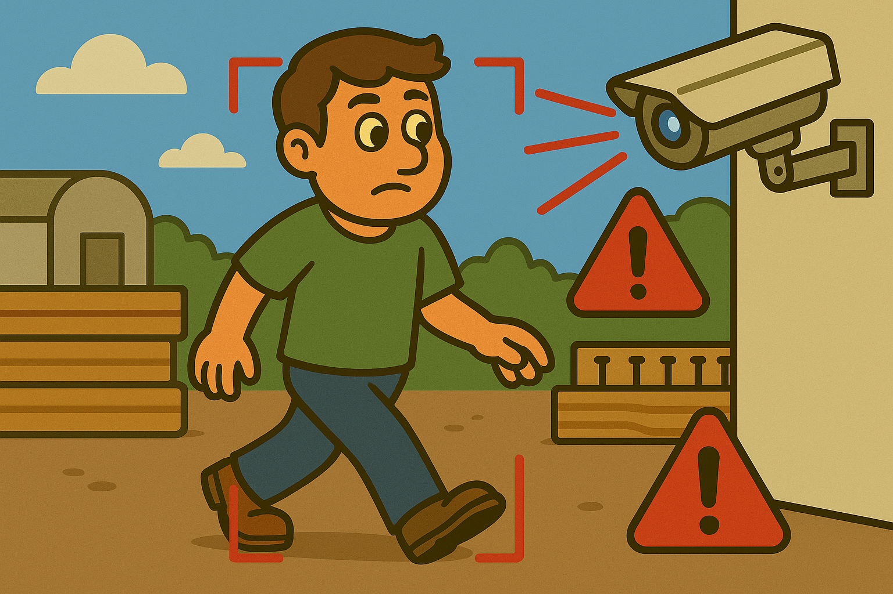

# 🦺 Sistema de detección para EPP

<p align="center">
  
</p>


Este proyecto mejora la seguridad en obras de construcción mediante la detección en tiempo real del uso de equipos de protección personal (EPP) como cascos, chalecos y mascarillas, así como la presencia de personas, usando YOLOv8, un algoritmo avanzado de detección de objetos.

---

## 📌 Tabla de Contenidos

- [🎯 Objetivo](#-objetivo)
- [✨ Funcionalidades](#-funcionalidades)
- [⚙️ Requisitos](#️-requisitos)
- [📦 Instalación](#-instalación)
- [🚀 Uso](#-uso)

---

## 🎯 Objetivo

Los sitios de construcción presentan múltiples riesgos, y garantizar que los trabajadores usen EPP es clave para prevenir accidentes. Este sistema automatiza la detección del uso de EPP mediante visión computacional, utilizando YOLOv8 para reconocer en tiempo real si una persona lleva casco, chaleco y/o mascarilla, y detectar su presencia.

---

## ✨ Funcionalidades

- ✅ **Detección de Cascos:** Identifica si un trabajador lleva puesto un casco.
- ✅ **Detección de Chalecos:** Identifica el uso de chalecos reflectantes.
- ✅ **Detección de Mascarillas:** Verifica si se está usando una mascarilla.
- ✅ **Detección de Personas:** Reconoce la presencia de personas en la escena.
- 📊 **Contador en Tiempo Real:** Muestra un panel lateral con el conteo de personas, cascos, chalecos y mascarillas detectados.
- 📩 **Alertas por Correo:** Envía un correo electrónico si una persona es detectada sin casco, con captura de imagen adjunta.
- 🔄 **Proceso Asíncrono de Correo:** Las alertas por correo no interrumpen el flujo del video.
- 📨 **Notificación en Pantalla:** Aparece una notificación en la esquina superior derecha cuando se envía un correo exitosamente.

---

## ⚙️ Requisitos

- Python 3.9
- YOLOv8 y sus dependencias ([Ver documentación oficial](https://docs.ultralytics.com))
- OpenCV
- Otras librerías especificadas en el archivo de entorno

---

## 📦 Instalación

### ✅ Usando `conda` (Recomendado)

1. Crear el entorno con `yolo_env.yml`:

   ```bash
   conda env create -f yolo_env.yml
   ```
2. Activar el entorno:
    ```bash
    conda activate yolo
    ```
3. Asegúrate de tener el archivo de pesos ppe.pt y colócalo en el directorio correspondiente.

---
## 🚀 Uso

1. Navega al directorio del proyecto:

```bash
cd path/to/project
```

2. Ejecuta el script principal:

```bash
python webcam.py
```

3. El sistema iniciará la detección en tiempo real usando la webcam o un archivo de video.

---

## Funcionalidades activas:

- 📦 Detección en Tiempo Real: Cajas delimitadoras con etiquetas de clase.

- 📈 Contador Dinámico: Panel lateral con conteo de EPPs y personas detectadas.

- 📤 Alertas por Correo: Se envía un email con imagen adjunta si se detecta una persona sin casco.

- 🖼️ Captura del Incidente: Se guarda la imagen del fotograma con la infracción.
